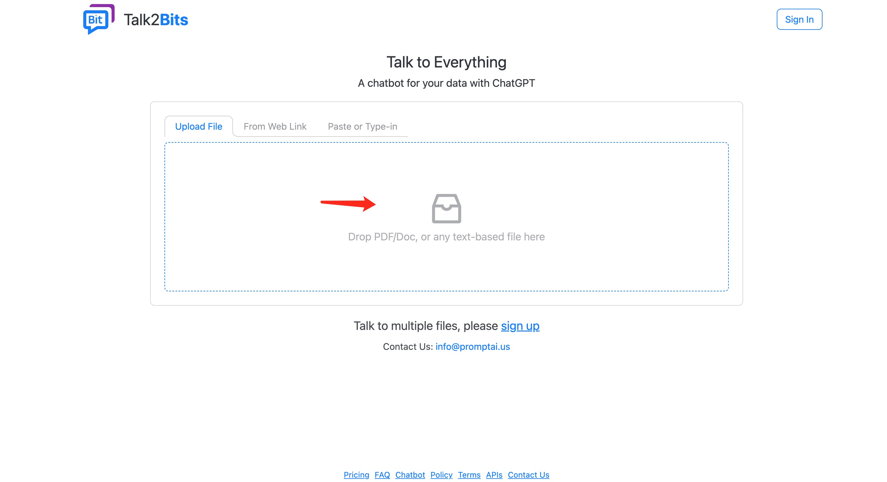
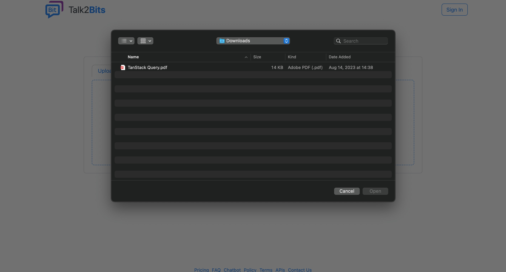
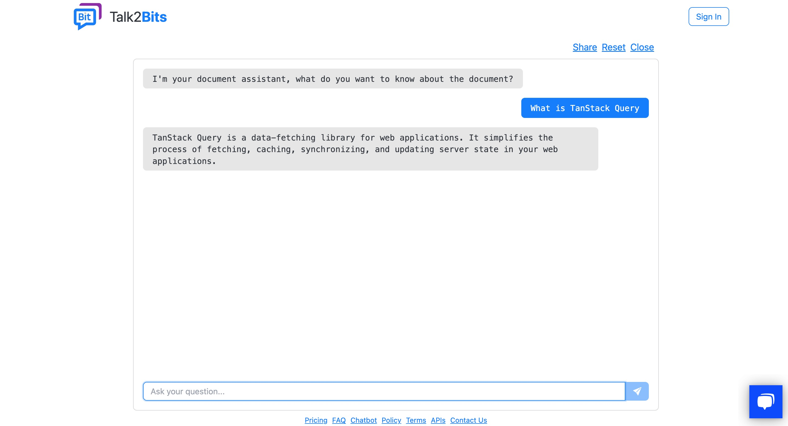

  <a href="./README.md">English</a> |
  <a href="./README_CN.md">简体中文</a>

#### [Website](https://talk2bits.com) • [Email](mailto:info@promptai.us)

Talk2Bits is a tool that automatically turns all forms of enterprise documents (FAQ, CSV, PDF, Doc, Text, HTML) into a knowledge base powered by GPT.

## Quick Start

1. Upload a file (or web link, text) to our talk2bits
   
2. Select a file to upload
   
3. After waiting for a few minutes, start the conversation
   

## Contact Us

If you have any questions, suggestions, or partnership inquiries, feel free to contact us through the following channels:

- Submit an Issue or PR on our GitHub Repo
- Send an email to info@promptai.us
- Send a message to [there](https://www.promptai.us/en/contact/)

## Security

To protect your privacy, please avoid posting security issues on GitHub. Instead, send your questions to info@promptai.us and we will provide you with a more detailed answer.
