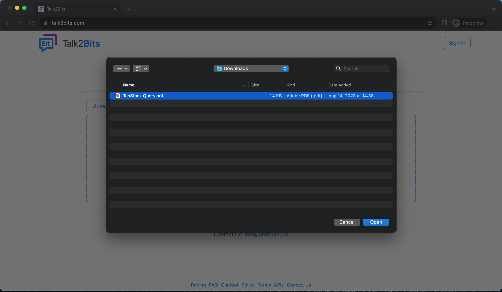
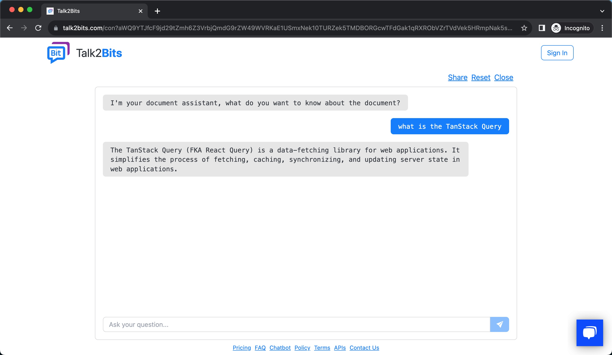

  <a href="./README.md">English</a>

#### [官网](https://talk2bits.com) • [邮箱](mailto:info@promptai.us)

Talk2Bits 是一个自动将各种形式的企业文档（FAQ、CSV、PDF、Doc、Text、HTML）转变为一个由 GPT 提供支持的知识库。

## Quick Start

1. 上传一个文件（或者 web 链接，文本）到 Talk2Bits
   
2. 选择一个文件
   
3. 等待系统分析几分钟后，开始对话。
   

## 联系我们

如果您有任何疑问、建议或合作咨询，请随时通过以下渠道与我们联系:

- 在我们仓库创建一个 Issue 或者 PR。
- 邮箱联系我们 info@promptai.cn
- 发送消息联系我们 [在这里](https://www.promptai.us/en/contact/)

## 安全

为了保护您的隐私，请避免在 GitHub 上发布安全问题。 相反，请将您的问题发送至 info@promptai.cn，我们将为您提供更详细的答案。
